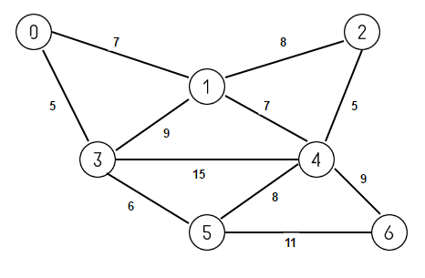

---

# **Kruskal's Algorithm**

## **Đồ thị**



### **Danh sách cạnh:**

```
0 1 7
1 2 8
0 3 5
1 3 9
1 4 7
2 4 5
3 4 15
3 5 6
4 5 8
4 6 9
5 6 11
```

### **Danh sách kề:**
- Đỉnh 0: [(1, 7), (3, 5)]
- Đỉnh 1: [(0, 7), (2, 8), (3, 9), (4, 7)]
- Đỉnh 2: [(1, 8), (4, 5)]
- Đỉnh 3: [(0, 5), (1, 9), (4, 15), (5, 6)]
- Đỉnh 4: [(1, 7), (2, 5), (3, 15), (5, 8), (6, 9)]
- Đỉnh 5: [(3, 6), (4, 8), (6, 11)]
- Đỉnh 6: [(4, 9), (5, 11)]

---

## **Kiểm nghiệm thuật toán**

### **Bảng trạng thái**

| Iteration | Unmarked      | Marked         | Current | 0  | 1  | 2  | 3  | 4  | 5  | 6  |
|-----------|---------------|----------------|---------|----|----|----|----|----|----|----|
| 0         | {0,1,2,3,4,5,6} | {}             |         | 0  | Inf| Inf| Inf| Inf| Inf| Inf|
| 1         | {1,2,3,4,5,6}   | {0}            | u = 0   | 0  | 7  | 5  | Inf| Inf| Inf| Inf|
| 2         | {2,3,4,5,6}     | {0,1}          | u = 1   | 0  | 7  | 8  | 9  | 7  | Inf| Inf|
| 3         | {3,4,5,6}       | {0,1,2}        | u = 2   | 0  | 7  | 8  | 9  | 7  | Inf| Inf|
| 4         | {4,5,6}         | {0,1,2,3}      | u = 3   | 0  | 7  | 8  | 9  | 7  | 6  | Inf|
| 5         | {5,6}           | {0,1,2,3,4}    | u = 5   | 0  | 7  | 8  | 9  | 7  | 6  | 11 |
| 6         | {}              | {0,1,2,3,4,5,6}| u = 4   | 0  | 7  | 8  | 9  | 7  | 6  | 11 |

---


### **Khởi tạo:**
- Đầu tiên, tạo một đồ thị với các cạnh được định nghĩa theo cặp `(src, dest, weight)`. Ta sẽ sử dụng một mảng các cạnh để lưu trữ dữ liệu này.

### **Bước 1: Sắp xếp các cạnh theo trọng số tăng dần**
- Để bắt đầu thuật toán Kruskal, tất cả các cạnh của đồ thị được sắp xếp theo trọng số (cạnh nhẹ nhất trước).

### **Bước 2: Tạo tập hợp rời rạc (Disjoint Set)**
- Mỗi đỉnh trong đồ thị sẽ được coi là một tập hợp riêng biệt, được lưu trữ trong một mảng `parent` (lưu trữ cha của mỗi đỉnh) và `rank` (để giữ độ sâu của cây).

### **Bước 3: Chọn các cạnh để thêm vào MST**
- Chúng ta sẽ duyệt qua danh sách cạnh đã được sắp xếp, kiểm tra nếu hai đỉnh của một cạnh chưa thuộc về cùng một tập hợp, thì ta có thể thêm cạnh đó vào cây bao trùm nhỏ nhất.
- Nếu hai đỉnh đã thuộc cùng một tập hợp, thì cạnh đó sẽ tạo thành một chu trình và không được thêm vào MST.

### **Bước 4: Hợp nhất các tập hợp**
- Sau khi chọn một cạnh, ta hợp nhất các tập hợp của hai đỉnh vào một tập hợp duy nhất, đảm bảo rằng không có chu trình xuất hiện trong MST.

### **Bước 5: Tiếp tục cho đến khi MST hoàn thành**
- Quá trình này tiếp tục cho đến khi số lượng cạnh trong MST bằng `V-1` (V là số lượng đỉnh trong đồ thị).

---

### **Output**
- Các cạnh trong cây bao trùm nhỏ nhất (MST):

```
(0 -- 3) trong so: 5
(0 -- 1) trong so: 7
(1 -- 4) trong so: 7
(3 -- 5) trong so: 6
(2 -- 4) trong so: 5
(4 -- 6) trong so: 9
```

Kết quả này là cây bao trùm nhỏ nhất (MST) của đồ thị, với tổng trọng số là `39`.

---

### **Cấu trúc dữ liệu và hàm:**

1. **Cấu trúc Edge:**
   - Cấu trúc `Edge` lưu trữ ba thông tin: `src`, `dest` và `weight` của một cạnh trong đồ thị.

2. **Cấu trúc Graph:**
   - `Graph` lưu trữ số lượng đỉnh `V`, số lượng cạnh `E` và mảng `edges` chứa tất cả các cạnh của đồ thị.

3. **Cấu trúc Subset:**
   - Cấu trúc `Subset` lưu trữ thông tin của mỗi đỉnh trong tập hợp rời rạc (Disjoint Set), bao gồm cha (`parent`) và độ sâu của cây (`rank`).

4. **Hàm `find`:**
   - Hàm `find` tìm đại diện của tập hợp chứa đỉnh `u` và thực hiện nén đường đi (path compression) để tối ưu hóa hiệu suất.

5. **Hàm `unionSets`:**
   - Hàm `unionSets` hợp nhất hai tập hợp chứa các đỉnh `x` và `y`. Nếu hai tập hợp có cùng độ sâu, một trong hai cây sẽ được gắn vào cây còn lại và độ sâu của cây gốc sẽ được tăng lên.

6. **Hàm `compareEdges`:**
   - Hàm `compareEdges` là hàm so sánh được sử dụng để sắp xếp các cạnh theo trọng số tăng dần.

7. **Hàm `kruskal`:**
   - Đây là hàm chính của thuật toán Kruskal. Nó thực hiện các bước của thuật toán từ việc sắp xếp các cạnh, đến việc chọn các cạnh phù hợp để thêm vào MST và hợp nhất các tập hợp.

---

## **Kết luận**
Thuật toán Kruskal là một trong các thuật toán phổ biến để giải bài toán cây bao trùm nhỏ nhất (MST). Code C này sử dụng cấu trúc dữ liệu Disjoint Set để hợp nhất các tập hợp của các đỉnh và đảm bảo không có chu trình trong cây bao trùm. Chúng ta có thể sử dụng thuật toán này cho nhiều loại đồ thị khác nhau, đặc biệt là những đồ thị thưa thớt.

---
